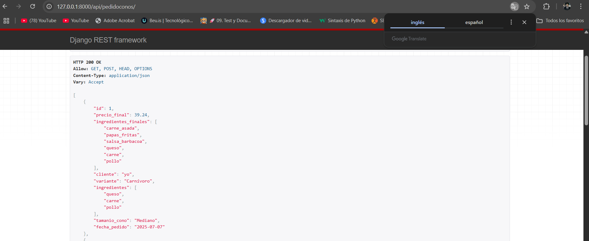
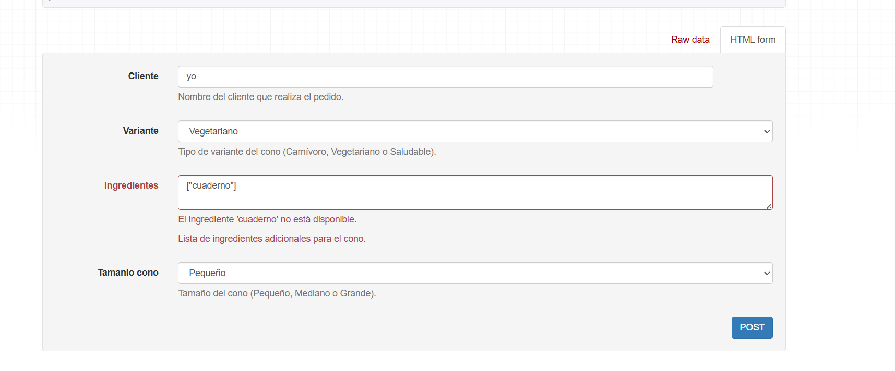
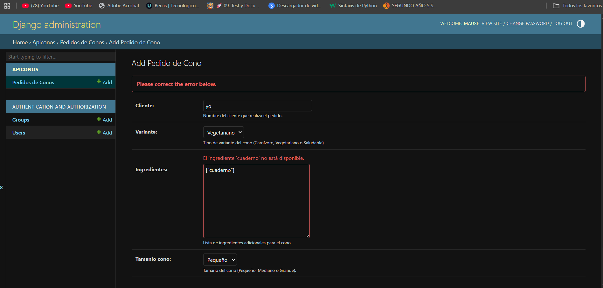
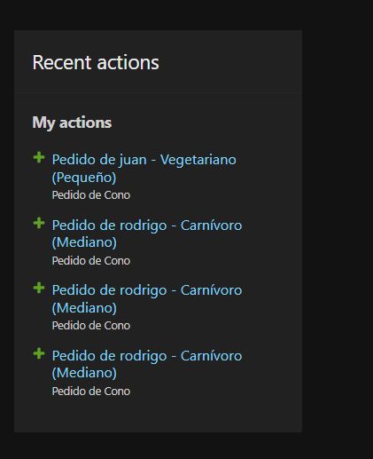

# pg2_parcial2.

## 📚 Parcial 2: API de Pedidos de Conos Personalizados
Desarrollador: Tu Nombre
Curso: Tu Curso
Materia: Patrones de Diseño
Fecha: 07 de Julio de 2025

## 📝 Descripción del Proyecto
Este proyecto implementa una API RESTful para la gestión de pedidos de conos personalizados, construida sobre el robusto framework Django y Django REST Framework. El objetivo principal de esta aplicación es servir como una demostración práctica de cómo los patrones de diseño pueden ser aplicados para crear una arquitectura de software que sea modular, extensible y fácil de mantener.

La API permite a los usuarios registrar pedidos de conos, especificando una variante base (Carnívoro, Vegetariano o Saludable), una lista de ingredientes adicionales (JSONField), el tamaño del cono y la fecha del pedido. La lógica compleja para calcular el precio final y la lista completa de ingredientes finales se realiza dinámicamente en tiempo de ejecución, integrando de forma elegante los patrones de diseño Factory, Builder y Singleton.

## 🏗️ Estructura del Proyecto
El proyecto se organiza en una aplicación principal de Django (api_patrones) que contiene la configuración global y un módulo de logger (para el patrón Singleton), y una aplicación secundaria (api_conos) que encapsula la lógica de negocio, modelos, serializadores, vistas y la implementación de los patrones de diseño específicos para los conos.

├── pg2_parcial2/
│   ├── api_patrones/
│   │   ├── settings.py           # Configuración global de Django
│   │   ├── urls.py               # Definición de URLs del proyecto
│   │   └── logger_conos.py       # 💡 Implementación del Patrón Singleton (Logger para Conos)
│   ├── api_conos/
│   │   ├── models.py             # 📦 Modelo de datos para PedidoCono
│   │   ├── serializers.py        # 🧩 Serializador que integra los patrones de diseño
│   │   ├── views.py              # 🌐 Vistas de la API RESTful (ViewSet)
│   │   ├── admin.py              # ⚙️ Configuración del panel de administración de Django
│   │   ├── forms.py              # 📝 Formulario para validación personalizada en el Admin
│   │   ├── base_conos.py         # 🌿 Clases base para los tipos de conos (Productos del Factory)
│   │   ├── factory_conos.py      # 🏭 Implementación del Patrón Factory
│   │   └── builder_conos.py      # 👷 Implementación del Patrón Builder
│   └── manage.py                 # Script de administración de Django
│   └── db.sqlite3                # Base de datos SQLite (en desarrollo)
│   └── README.md                 # Este archivo de documentación

## ✨ Patrones de Diseño Aplicados
Se han aplicado tres patrones de diseño fundamentales para estructurar y organizar la lógica de negocio, especialmente en el cálculo de los atributos personalizados del serializador.

1. Patrón Factory Method
¿Qué es y Por Qué se Usó?
El Patrón Factory Method (o Fábrica) se utiliza para crear objetos sin especificar la clase exacta del objeto que se va a crear. En este proyecto, su propósito es instanciar la lógica específica de un tipo de cono base (Carnívoro, Vegetariano, Saludable) de manera centralizada. Esto es crucial porque desacopla el código cliente (nuestro serializador) de la complejidad de la instanciación directa de las clases de conos, permitiendo añadir nuevas variantes de cono en el futuro con un impacto mínimo en el código existente.

¿Dónde está implementado en el código?
La implementación principal reside en api_conos/factory_conos.py, con la clase ConoFactory y su método estático obtener_cono_base(variante). Este método actúa como el "productor" de las instancias de ConoCarnivoro, ConoVegetariano o ConoSaludable, las cuales están definidas en api_conos/base_conos.py.

¿Cómo se aplica en un método implementado?
La aplicación de este patrón se evidencia claramente en el método auxiliar _build_cono_and_get_builder del PedidoConoSerializer (ubicado en api_conos/serializers.py). Aquí, la fábrica es invocada para obtener la instancia de cono base adecuada:

# api_conos/serializers.py

def _build_cono_and_get_builder(self, obj):
    # 🏭 Patrón Factory: Obtener la base del cono según la variante
    cono_base = ConoFactory.obtener_cono_base(obj.variante)
    # ... (resto de la lógica del Builder) ...
    return builder

Al pasar obj.variante (ej., "Carnívoro"), el ConoFactory se encarga de devolver la instancia correcta de ConoCarnivoro, sin que el serializador necesite saber cómo se construye internamente.

## 2. Patrón Builder
¿Qué es y Por Qué se Usó?
El Patrón Builder (o Constructor) se emplea para construir objetos complejos paso a paso, separando el proceso de construcción de la representación final del objeto. En nuestra API, este patrón es fundamental para ensamblar un cono personalizado a partir de un cono base, añadiendo de forma incremental los ingredientes adicionales seleccionados y ajustando el precio y la lista de ingredientes según el tamaño. Esto proporciona una flexibilidad excepcional para crear configuraciones de conos variadas y complejas, sin que la clase PedidoCono tenga que manejar toda esa lógica de construcción.

¿Dónde está implementado en el código?
Las clases centrales de este patrón se encuentran en api_conos/builder_conos.py:

ConoPersonalizadoBuilder: Actúa como el constructor concreto, definiendo los pasos para agregar_ingrediente y ajustar_tamanio, y manteniendo el estado intermedio de la construcción (precio e ingredientes acumulados).

ConoDirector: Es el director que orquesta la secuencia de pasos de construcción, recibiendo el Builder y los datos del pedido para construir el cono final.

¿Cómo se aplica en un método implementado?
La integración del Builder se realiza en el mismo método _build_cono_and_get_builder del PedidoConoSerializer (api_conos/serializers.py), donde se coordina la construcción del cono:

# api_conos/serializers.py

def _build_cono_and_get_builder(self, obj):
    # ... (cono_base obtenido del Factory) ...
    # 👷 Patrón Builder: Inicializar el constructor y el director
    builder = ConoPersonalizadoBuilder(cono_base)
    director = ConoDirector(builder)

    # Construir el cono con los ingredientes y el tamaño
    ingredientes_a_procesar = obj.ingredientes if isinstance(obj.ingredientes, list) else []
    director.construir(ingredientes_a_procesar, obj.tamanio_cono)

    return builder

El director.construir() invoca los métodos del builder (agregar_ingrediente, ajustar_tamanio) en el orden correcto, permitiendo que el builder actualice el precio_final y los ingredientes_finales del cono de forma incremental.

## 3. Patrón Singleton
¿Qué es y Por Qué se Usó?
El Patrón Singleton garantiza que una clase tenga una única instancia y proporciona un punto de acceso global a ella. En este proyecto, se utiliza para la clase LoggerConos, asegurando que solo exista una instancia de este registrador en toda la aplicación. Esto es fundamental para centralizar el registro de logs de las operaciones de cálculo (como el precio final o la obtención de ingredientes), permitiendo que todos los eventos se almacenen en un único lugar de manera consistente y eficiente.

¿Dónde está implementado en el código?
La implementación del Singleton se encuentra en el archivo api_patrones/logger_conos.py, con la clase LoggerConos. La lógica para asegurar la instancia única se maneja de forma transparente a través de la sobrescritura del método mágico __new__.

¿Cómo se aplica en un método implementado?
La aplicación del Singleton se observa en los métodos get_precio_final y get_ingredientes_finales del PedidoConoSerializer (api_conos/serializers.py), donde se registra cada operación de cálculo:

# api_conos/serializers.py

def get_precio_final(self, obj):
    builder = self._build_cono_and_get_builder(obj)
    # 📝 Patrón Singleton: Registrar la operación de cálculo de precio
    LoggerConos().registrar(f"Se calculó el precio final para el pedido de cono {obj.id}")
    return builder.obtener_precio_final()

Cada vez que se llama a LoggerConos().registrar(...), se accede a la misma y única instancia del LoggerConos, garantizando que todos los logs se centralicen en un solo punto.

# 🚀 Configuración y Ejecución
Sigue estos pasos para poner en marcha el proyecto en tu entorno local.

Requisitos Previos
Python 3.x (versión 3.8 o superior recomendada)

pip (gestor de paquetes de Python)

Instalación
Clona el repositorio de GitHub:

git clone https://github.com/tu_usuario/pg2_parcial2.git
cd pg2_parcial2

Crea y activa un entorno virtual (altamente recomendado para aislar las dependencias):

python -m venv env
# En Windows:
.\env\Scripts\activate
# En macOS/Linux:
source env/bin/activate

Instala las dependencias del proyecto:

pip install Django djangorestframework django-extensions

Realiza las migraciones de la base de datos:

Primero, crea los archivos de migración:

python manage.py makemigrations

Luego, aplica las migraciones a la base de datos:

python manage.py migrate

Crea un superusuario para acceder al panel de administración de Django:

python manage.py createsuperuser

Sigue las instrucciones en la terminal para establecer un nombre de usuario, correo electrónico y contraseña.

Ejecución
Inicia el servidor de desarrollo de Django:

python manage.py runserver

Accede a la API y al Panel de Administración:

Endpoint de la API: http://127.0.0.1:8000/api/pedidoconos/

Panel de Administración de Django: http://127.0.0.1:8000/admin/ (usa las credenciales del superusuario creado).

# 🧪 Pruebas y Evidencia
Interfaz de Registro de Datos en el Administrador de Django
Aquí puedes ver la interfaz del panel de administración de Django, donde se pueden crear y gestionar los pedidos de conos. El campo "Ingredientes" espera una lista JSON, y la validación personalizada asegura que solo se acepten ingredientes válidos.

Lista de Registros en el Endpoint de API REST con Atributos Calculados
Esta captura muestra el endpoint de la API REST (/api/pedidoconos/) con una lista de pedidos de conos. Observa cómo los atributos precio_final e ingredientes_finales se calculan y se muestran dinámicamente para cada registro, demostrando la aplicación de los patrones de diseño en tiempo de ejecución.

¡Disfruta explorando la implementación de los patrones de diseño en esta API de pedidos de conos!

